<picture>
  <source media="(prefers-color-scheme: dark)" srcset="./dark.svg">
  <source media="(prefers-color-scheme: light)" srcset="./light.svg">
  
</picture>

 

### Hi, I'm Hammad 👋

I'm a **BS Software Engineering student at COMSATS University Islamabad (Abbottabad Campus)**. I build mobile apps with **Flutter & Firebase**, full-stack web platforms with **Next.js & TypeScript**, and data pipelines for Arabic phonetics — and I like my code backed by solid architecture and, where it counts, formal reasoning.

 

## 🧭 Focus

- **Mobile** — Flutter apps with Cubit state management, GoRouter navigation and Firebase Auth
- **Full-stack web** — Next.js 15, TypeScript, Tailwind, shadcn/ui, Prisma + PostgreSQL, Auth.js, Stripe
- **Applied AI** — real-time tajweed error detection and LLM-powered features via the Anthropic API
- **Data pipelines** — word-level phoneme datasets exported to Parquet and JSONL
- **Software design** — design patterns, clean architecture, formal specification & verification

 

## 🚀 Featured Projects

| Project | What it is | Built with |
| :-- | :-- | :-- |
| **[MakharijPro AI](https://github.com/mustfaaaa/makharij-pro)** | Quran / tajweed mobile app with real-time tajweed error detection and an "Ask AI" assistant (Rattil AI) | Flutter · Firebase · Cubit · GoRouter |
| **ElectroCalcHub** | Professional electrical-engineering calculator platform — pure-TypeScript calculation core with a self-registering calculator catalog | Next.js 15 · TypeScript · Prisma · PostgreSQL · Stripe |
| **Makharij Dataset** | Data pipeline producing word-level phoneme metadata enriched with the 17 Arabic *makhārij* (articulation points) — ~77K words, ~522K phone tokens | Parquet · JSONL |
| **[SDA](https://github.com/hammadfareed4/SDA)** | Projects and assignments on software design, architecture patterns and development methodologies | Java |
| **[Observer Design Pattern](https://github.com/hammadfareed4/OBSERVER_DESIGN_PATTERN)** | A worked implementation of the Observer pattern | Java |

 

## 🎓 Academic Work

- **Formal Methods** — Z notation, Petri nets, Kripke structures, LTL / CTL, BDD / OBDD / ROBDD
- **Software Project Management** — full SPMP for MakharijPro AI across all 10 PMBOK knowledge areas
- **Software Reverse Engineering** — multi-tier architecture and middleware integration design
- **Human-Computer Interaction** — UI prototyping, HTA / GOMS analysis, controlled experiments
- **Mobile App Development** — Flutter & Firebase

 

## 🛠️ Engineering Stack

  

**Also:** industrial power metering over Modbus RTU / RS-485 (Siemens SENTRON PAC meters).

 

## 💼 Beyond Code

I run **Mir Rent A Car**, a chauffeur-driven car rental business in Islamabad — including setting up its digital presence end to end (Google Business Profile, WhatsApp Business and the website design).

 

<h2 align="center">📊 GitHub Contributions</h2>

  <picture>
    <source media="(prefers-color-scheme: dark)" srcset="https://raw.githubusercontent.com/hammadfareed4/hammadfareed4/output/github-snake-dark.svg" />
    <source media="(prefers-color-scheme: light)" srcset="https://raw.githubusercontent.com/hammadfareed4/hammadfareed4/output/github-snake.svg" />
    
  </picture>

 

## 📫 Connect

  

